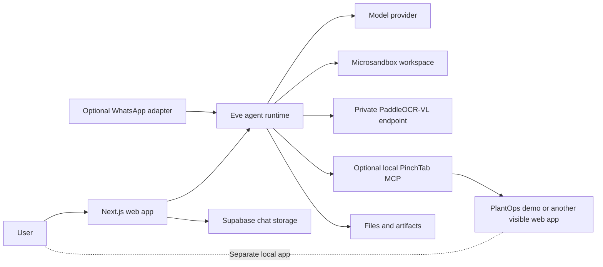
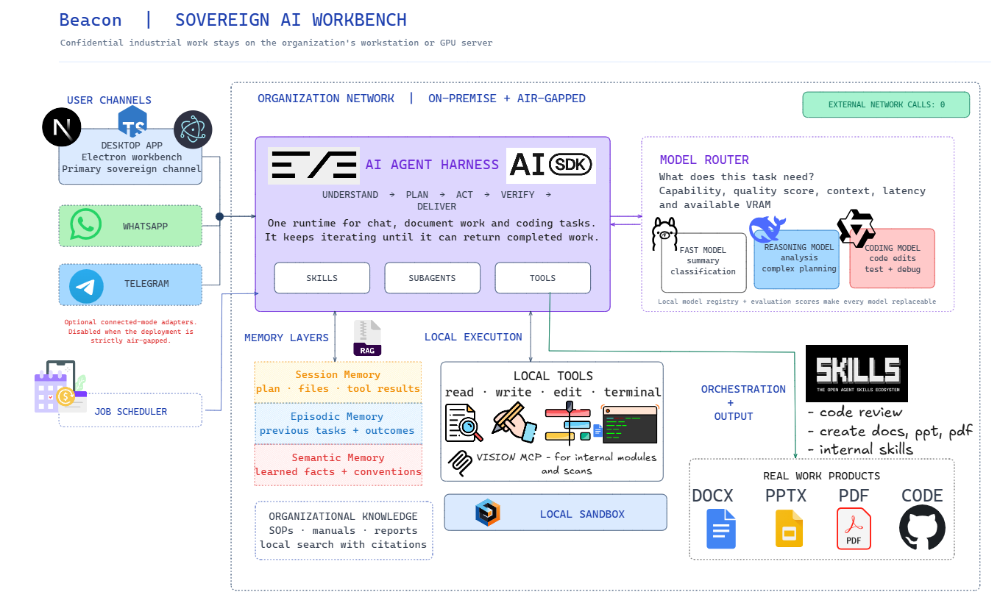

# Beacon

Beacon is a local-first AI workbench for industrial tasks. Its current web app
uses the Eve agent runtime to handle chat, inspect files, create work products,
and optionally control a local browser. It also includes a separate plant
maintenance demo that shows how an agent can turn inspection findings into a
work order through the same interface a person uses.

The app can run on a workstation, but that alone does not make every operation
local or air-gapped. Model and OCR requests go to the endpoints you configure.
For a fully on-premises setup, run those services inside your network and point
Beacon to them.

## Architecture



The web app starts Eve alongside Next.js. Each chat gets its own Eve session
and microsandbox workspace. The workspace denies network access while a session
runs. Chat threads, messages, and events are stored in Supabase. The separate
PlantOps demo stores its sample assets and work orders in browser storage.

Beacon selects a model per chat. The current model picker includes hosted models
through OpenCode Go and a self-hosted, OpenAI-compatible Qwen 3.8 27B Max
endpoint. The agent connects to these providers with the Vercel AI SDK and its
OpenAI and OpenAI-compatible provider packages.

For inspection reports, Beacon stages a PDF in the agent workspace and sends it
to the configured private PaddleOCR-VL endpoint. The agent can use the parsed
report and extracted images as evidence. Browser control is optional; when
enabled, Beacon connects through a local PinchTab MCP bridge and acts through
the visible browser interface.

### Current implementation and planned architecture

The repository implements the web app, Eve agent, Supabase chat persistence,
Microsandbox workspaces, the optional WhatsApp adapter, inspection-report OCR,
PinchTab browser control, and the PlantOps demo.

The diagram shared with this project also includes an Electron desktop client,
Telegram, scheduled jobs, persistent episodic or semantic memory, organizational
document search, and a task-based router that assigns different model roles.
Those are architecture ideas, not features currently implemented in this
repository. The `apps/desktop` workspace is only a placeholder.

The image below shows that longer-term design, not the current implementation.
Its "zero external network calls" state depends on running every model and
document service inside the organization network and disabling connected-mode
adapters.



## Run the web app

Requirements: Bun 1.3.14 and Node.js 24 or newer.

1. Copy `apps/web/.env.example` to `apps/web/.env.local`.
2. Configure the model provider you want to use, and set up Supabase chat
   storage. Keep `SUPABASE_SECRET_KEY` server-side; never put it in browser code.
3. From the repository root, install dependencies and start the app:

   ```sh
   bun install
   bun dev
   ```

4. Open [http://localhost:3000](http://localhost:3000).

The web app needs `SUPABASE_URL` and `SUPABASE_SECRET_KEY` for chat persistence.
Choose a model in the UI. OpenCode Go models need `OPENCODE_API_KEY`. The Qwen
option needs `QWEN_API_KEY`; set `QWEN_BASE_URL` to the OpenAI-compatible server
that serves your Qwen deployment. To run inference locally, point it at a
locally hosted server. Beacon does not download or run model weights itself.

PDF inspection also needs `PADDLE_OCR_BASE_URL` for a private PaddleOCR-VL
service. To keep document processing inside your network, host that service on
your workstation or organization network. The web app can run locally while
model or OCR requests still go to remote services, depending on your settings.

## Run the PlantOps demo

PlantOps is a standalone local maintenance app. It uses synthetic data and
browser storage; it is not connected to a real plant or backend database.

```sh
bun run demo:plant
```

It runs at [http://localhost:3100](http://localhost:3100). To use it with
Beacon, start the web app separately, enable browser control, and ask the agent
to prepare a work order using findings from an inspection report. The agent
uses the visible UI and waits for approval before submission. See the
[PlantOps specification](docs/specs/plant-maintenance-demo.md) for the full
workflow and acceptance criteria.

## Optional integrations

- **Browser control:** Install and configure PinchTab locally, then enable
  browser control from Beacon. The agent only receives browser tools when this
  feature is enabled.
- **WhatsApp:** The standalone adapter runs with `bun run dev:whatsapp` and
  needs its WhatsApp, Deepgram, and Cartesia settings from
  `apps/web/.env.example`. Voice transcription and voice replies use Deepgram
  and Cartesia, so those requests are not local by default. On Windows, the
  adapter's shell script may need Git Bash or WSL.
- **OCR:** The private PaddleOCR-VL endpoint must be running and reachable from
  the web app. Configure its URL in `PADDLE_OCR_BASE_URL`.

## Workspace

```text
apps/
  web/                     Next.js chat workbench
  plant-maintenance-demo/  Standalone PlantOps demo
  desktop/                 Placeholder workspace
packages/
  agent/                   Eve runtime, model connections, tools, and skills
  browser-control/         PinchTab process and MCP bridge
```

## Checks

Run these from the repository root:

```sh
bun run typecheck
bun run lint
bun run build
bun run agent:info
bun run web:test
bun run agent:test
bun run browser:test
bun run demo:plant:test
```

## Hacktoberfest 2026

Beacon is being submitted to the
[Hacktoberfest Weekend Challenge: Build for a Friend](https://dev.to/challenges/hacktoberfest-weekend-2026-10-01).

Tags: `#hacktoberfest` `#hacktoberfest2026` `#devchallenge`

DEV post: [Beacon: turning inspection reports into work orders](https://dev.to/parthlightning/beacon-turning-inspection-reports-into-work-orders-8j1)
